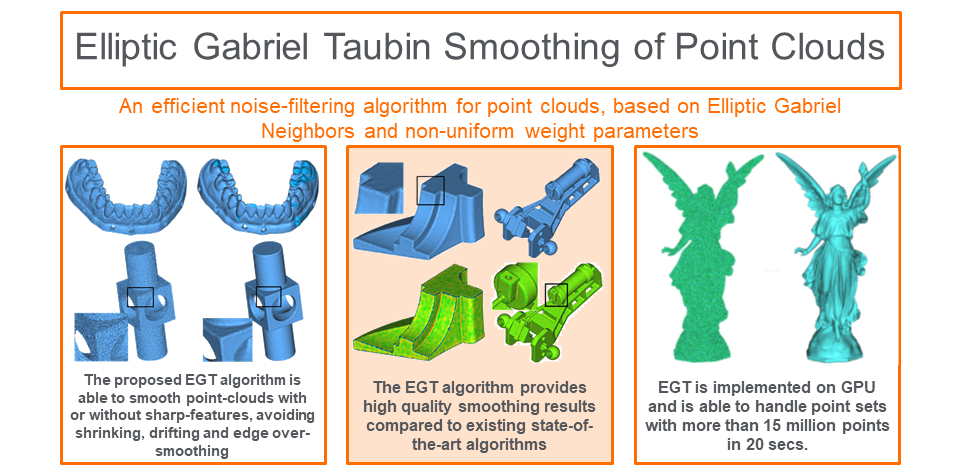

# EGTPointCloudSmoothing

    

<b>Elliptic Gabriel Smoothing of Point Clouds</b> accompanying software.

Paper published at <a href="https://www.journals.elsevier.com/computers-and-graphics">Computers & Graphics</a>

<i>Note: This software requires an NVIDIA Graphics card with Compute Capability 5.0 and higher 
and <a href="https://developer.nvidia.com/cuda-toolkit">CUDA</a> preferably 
of version 11 and higher. This software requires <a href="https://www.cgal.org/">CGAL</a> and as a 
consequence also <a href="https://www.boost.org/">BOOST</a>. The process to compile
the software in Windows using the VISUAL STUDIO 2019 and later tools is described below.</i>
 

A CMAKE and a Microsoft VS2019 solution is provided in the repository.

<b>CMAKE Compilation</b>

This is the most advisable way to build the software as it will build the 
solution of Visual Studio automatically. Provided that CGAL and BOOST and CUDA toolkit with Visual Studio 
integration are installed, the process of generating the Visual Studio solution is straightforward.
Please consider using the <a href="https://cmake.org/download/">cmake-gui tool</a>.

<b>VS2019 solution compilation</b>

Please note that the existing VS solution uses the CUDA 11.6 target. If your CUDA version is different 
you need to edit the file EGTSmoothingVS2019.vcxproj 
and replace in the two lines: 
<i>Import Project="$(VCTargetsPath)\BuildCustomizations\CUDA 11.6.props"</i> 
<i>Import Project="$(VCTargetsPath)\BuildCustomizations\CUDA 11.6.targets"</i> 
The cuda version you have. 
Also please set appropriately the environmental variables $(BOOST_DIR), $(CGAL_INCLUDE) where CGAL and BOOST include directories exist. 

<b>Execution</b>

If a binary executable is successfully built, for example EGTSmoothingVS2019.exe, the program is executed as: 
 
EGTSmoothingVS2019.exe cad_complex_noise.xyz 75 0.63 -0.64 0.75 0 cad_complex_smoothed_egt.xyz 
 
The first argument is the point cloud to be smoothed which is a text file of points of the form "x y z nx ny nz" for each line (x, y, z the point coordinates, nx, ny, nz the normal coordinates). 
The second argument is the number of iterations EGT will be performed. 
The third argument is the lambda parameter. 
The fourth argument is the mu parameter. 
The fifth parameter is the alpha parameter. 
The sixth parameter (set to zero in our paper), 0 for use of the Gaussian weights of the paper. 
The seventh parameter is the target smoothed point cloud as a text file of the form "x y z" for each line.

    

