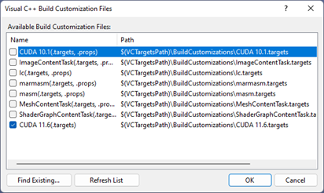

# EGTPointCloudSmoothing

    

<b>Elliptic Gabriel Smoothing of Point Clouds</b> accompanying software.

Paper published at <a href="https://www.journals.elsevier.com/computers-and-graphics">Computers & Graphics</a>

<i>Note: This software requires an NVIDIA Graphics card with Compute Capability 5.0 and higher 
and <a href="https://developer.nvidia.com/cuda-toolkit">CUDA</a> preferably 
of version 11 and higher. This software requires <a href="https://www.cgal.org/">CGAL</a> and <a href="https://sourceforge.net/projects/boost/">BOOST</a>. The process to compile
the software in Windows using the VISUAL STUDIO 2019 and later tools is described below.</i>
 

A CMAKE and a Microsoft VS2019 solution is provided in the repository.

<b>CMAKE Compilation</b>

Please consider using the <a href="https://cmake.org/download/">cmake-gui tool</a>.

This is the most advisable way to build the software as it will build the 
solution of Visual Studio automatically. The software depends on CGAL and BOOST. A guide to install both libraries is provided below.
 

<b><i>Boost installation</i></b>

The most easy way to install boost is to visit <a href="https://sourceforge.net/projects/boost/">this</a> link. Please choose 
to download a file like boost_1_79_0-msvc-14.1-64.exe. This file installs the BOOST library in 
a directory that the user selects, for example D:\Dev\boost_1_79_0.

The user then needs to set the environmental variables:  
BOOST_ROOT pointing to D:\Dev\boost_1_79_0 
BOOST_INCLUDEDIR pointing to D:\Dev\boost_1_79_0 
BOOST_LIBRARYDIR pointing to D:\Dev\boost_1_79_0\lib64-msvc-14.1 
Now CMake will be able to find Boost in the system.

<b><i>CGAL installation</i></b>

Suppose that <a href="https://github.com/CGAL/cgal/releases/download/v5.4/CGAL-5.4.zip">this</a> version
of CGAL is downloaded and unzipped to directory: D:\Dev\CGAL-5.4 then the following environmetal variable needs
to be set: 
CGAL_DIR pointing to D:\Dev\CGAL-5.4  
Now CMAKE can find CGAL.

Alternatively CGAL and BOOST directories can be installed in 
the C:\Program Files directory and CMAKE will find them automatically.
This is though recommended as a last resort.

<b><i>CUDA installation</i></b>

Provided CUDA toolkit with Visual Studio integration is installed, 
CMAKE will find CUDA for the specific Visual Studio chosen.

Now everything is set to build the software using the cmake-gui tool.

<b>VS2019 solution compilation</b>

Please note that the existing VS solution uses the CUDA 11.6 target. If your CUDA version is different
then you should right click on the solution EGTSmoothingVS2019 and choose Build Dependencies (Figure below). Then a new dialog
will open (Figure below) where you can choose the cuda version you have.

        

Also please set appropriately the environmental variables %#36(BOOST_DIR) = \\$(BOOST_ROOT), \\$(CGAL_INCLUDE) = \\$(CGAL_DIR)\include .

<b>Execution</b>

The program is executed as: 
 
EGTSmoothingVS2019.exe cad_complex_noise.xyz 75 0.63 -0.64 0.75 0 cad_complex_smoothed_egt.xyz 
 
The first argument is the point cloud to be smoothed which is a text file of points of the form "x y z nx ny nz" for each line (x, y, z the point coordinates, nx, ny, nz the normal coordinates). 
The second argument is the number of iterations EGT will be performed. 
The third argument is the lambda parameter. 
The fourth argument is the mu parameter. 
The fifth parameter is the alpha parameter. 
The sixth parameter (set to zero in our paper), 0 for use of the Gaussian weights of the paper. 
The seventh parameter is the target smoothed point cloud as a text file of the form "x y z" for each line.  

In the folder PointClouds we have provided the noisy point clouds (xyz format) and their associated ground-truth (ply format) in order to reproduce 
  the results of the paper.

    

